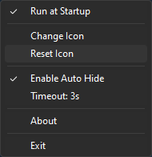
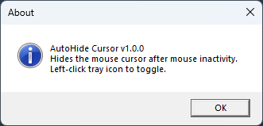

# AutoHide Cursor 🖱️

**AutoHide Cursor** is a lightweight Windows tray app that automatically hides the mouse cursor after inactivity. Set a custom timeout, toggle the behavior from the tray, change the tray icon, and control auto-start – all running as a **standard user** (no admin required).

## 🚀 Features

- **Auto-hide cursor** – Cursor disappears automatically after inactivity (default 10s).
- **Configurable timeout** – Cycle between **3 / 5 / 10 / 30 / 60 seconds** from the tray menu.
- **Quick toggle** – Left-click the tray icon to enable/disable auto-hide globally.
- **Custom tray icon** – Load any `.ico`; default icon auto-adapts to taskbar light/dark mode.
- **Run at startup** – Enable or disable auto-start via the tray menu (HKCU only).
- **Persistent settings** – Timeout, enabled state, and custom icon are saved and restored on next launch.
- **Auto-update** – Checks for a newer version on app start and updates if available.
- **System-wide behavior** – Works across apps, full-screen windows, and desktops on Windows 10/11.

## 💻 System Requirements

- **Windows 10 22H2** or **Windows 11 23H2/24H2** (and newer)
- No administrator privileges required
- Uses standard Windows APIs (low-level mouse hook + system cursor swap)

## 📸 Screenshots

|  |  |  |
|---|---|---|

## ⬇️ Install & Run

1. Download the latest release from [Releases](https://github.com/emp0ry/AutoHideCursor/releases).
2. Extract the archive (if zipped) and launch `AutoHideCursor.exe`.
3. The app appears as an icon in the notification area (system tray).

> **Uninstall**: Exit the app from the tray (`Exit`) and delete the files.  
> If you enabled *Run at Startup*, turn it off from the tray menu before removing the app.

## 🧭 Usage

- **Enable/disable auto-hide**:  
  - **Left-click** the tray icon to toggle AutoHide Cursor on/off.
- **Change timeout**:  
  - **Right-click** → select **Timeout: Xs** to cycle through `3s → 5s → 10s → 30s → 60s`.
- **Run at startup**:  
  - **Right-click** → **Run at Startup** (checked = enabled, unchecked = disabled).
- **Custom tray icon**:  
  - **Right-click** → **Change Icon** to pick a `.ico` file.  
  - **Right-click** → **Reset Icon** to go back to the default, theme-aware icon.
- **About dialog**:  
  - **Right-click** → **About**.
- **Exit**:  
  - **Right-click** → **Exit** (cursor is restored before the app quits).

## 🤝 Contributing

Issues and PRs are welcome!  
When reporting bugs, please include:

- Windows version (e.g., *Windows 11 24H2*),
- Whether you use a custom icon,
- The timeout you had set,
- Steps to reproduce the issue.

## ☕ Donation

If you find this app useful:

## 📄 License

MIT License. See [LICENSE](LICENSE.txt) for details.